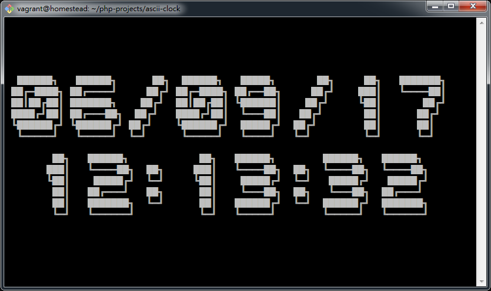

Node.js ASCII Clock
=================================================

Write just for fun. See demo [here](https://s25g5d4.github.io/ascii-clock/).




## 3 Line Version (12-hour Clock with Full 4-digit Year)


## Usage

Node.js >= 6.

`node ascii-clock.js`

3-line:

`node ascii-3line.js`

Note in text mode some characters might not be displayed correctly.

Import as module:

```
var asciiClock = require('./asciiClock');
asciiClock.displayTime();
asciiClock.stop();
```

## Exports

The exported object are defined as:

```
{
  displayTime: function([logger[, clear]]) => void,
  stop: function() => void
}

logger: function(str) => void /* see Custom Functions */
clear: function() => void     /* see Custom Functions */
```

## Custom Functions

It is possible to use custom logger and screen clear functions. Custom
functions are passed as arguments:

`asciiClock.displayTime([logger[, clear]])`

For example, default logger and screen clear function are defined as:
`(str) => console.log(str)` and
`() => console.log('\033c\x1B[2J\x1B[0f\u001b[0;0H\n\n\n\n')`.

## Browser Support

See [browser-demo.html](browser-demo.html).

A namespace `window.asciiClock` will be used to place all methods and
properties. If there is a name conflict of `window.asciiClock`,
old `window.asciiClock` will be stored in `window.asciiClock.original`.
